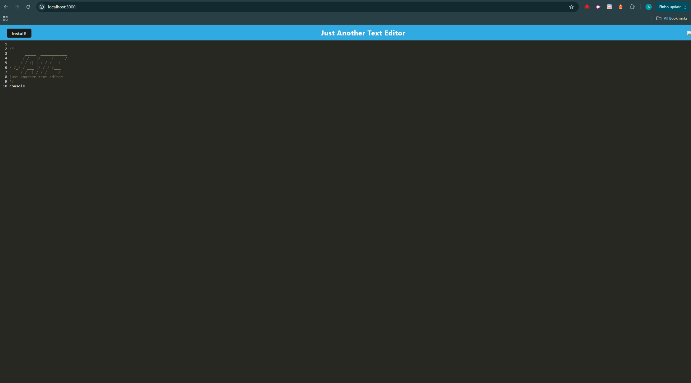

#  J.A.T.E - Just Another Text Editor  Module 19 

##  Description

J.A.T.E is a Progressive Web Application (PWA) that functions as a browser-based text editor. Designed for developers and students, it enables writing, saving, and retrieving notes or code snippets directly in the browser. This application supports offline usage and includes an installable desktop experience via service workers and IndexedDB. Built with Webpack, Workbox, and Babel, J.A.T.E meets the criteria for a PWA by providing offline functionality, a manifest for installation, and efficient caching strategies.

## Acceptance Criteria

GIVEN a text editor web application

WHEN I open my application in my editor

THEN I should see a client server folder structure

WHEN I run `npm run start` from the root directory

THEN I find that my application should start up the backend and serve the client

WHEN I run the text editor application from my terminal

THEN I find that my JavaScript files have been bundled using webpack

WHEN I run my webpack plugins

THEN I find that I have a generated HTML file, service worker, and a manifest file

WHEN I use next-gen JavaScript in my application

THEN I find that the text editor still functions in the browser without errors

WHEN I open the text editor

THEN I find that IndexedDB has immediately created a database storage

WHEN I enter content and subsequently click off of the DOM window

THEN I find that the content in the text editor has been saved with IndexedDB

WHEN I reopen the text editor after closing it

THEN I find that the content in the text editor has been retrieved from our IndexedDB

WHEN I click on the Install button

THEN I download my web application as an icon on my desktop

WHEN I load my web application

THEN I should have a registered service worker using workbox

WHEN I register a service worker

THEN I should have my static assets pre cached upon loading along with subsequent pages and static assets

WHEN I deploy to Render

THEN I should have proper build scripts for a webpack application

##  Installation

1. Clone this repository  
2. Navigate to VScode
3. add any mssing parts lionk in the client file
4. npm i 
5. npm run start:dev
6. Open your browser and go to:  
http://localhost:3000
7. deploy on Render

here is the link : 

 